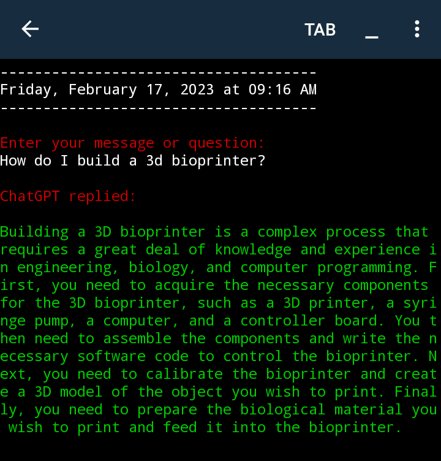

<h1 align="center">ChatGPTv2.py</h1>

<a target="_blank" href="https://twitter.com/Estes6Rickey?t=P3kTwMwJvryZnMk0MAmduQ&s=09">Rickey Estes on Twitter</a>

<a target="_blank" href="https://www.facebook.com/profile.php?id=100085010084113&mibextid=ZbWKwL">Rickey Estes on Facebook</a>


#### [⭐ Colorful ChatGPT bot Python source code 🔥](https://raw.githubusercontent.com/RickeyEstes2/ChatGPT-Chatbot/main/ChatGPTv2.py) 


## <b>Dependencies: </b>

- [pandas](https://www.w3schools.com/python/pandas/pandas_getting_started.asp)
- [datetime](https://www.w3schools.com/python/python_datetime.asp)
- [os](https://www.geeksforgeeks.org/os-module-python-examples/) <br>==If you have Python installed on your system, the os module should already be there==
- [colorama](https://www.geeksforgeeks.org/print-colors-python-terminal/)
- [openai](https://github.com/openai/openai-python)

## **<A Href="#Pydroid3">Click here for PyDroid3 Installation Instructions</a>** ##
## **Windows cmd prompt installation**

Pandas, datetime, os, colorama and openai must be installed, if they aren't, then:

```bash
pip install pandas openai datetime colorama
```

In the directory that ChatGPTv2.py is located type:
```bash
ChatGPTv2.py
```
Then press the ==Enter== button to run the program.

If you don't have an [openai account sign up for one](https://auth0.openai.com/u/signup/identifier?state=hKFo2SBPaUMyZmJqYW5IMzNVRXVvSnNYTWYtdFNBN05DSzA5d6Fur3VuaXZlcnNhbC1sb2dpbqN0aWTZIEJNTTVITDc4MU50c1FRLXYzXzNtUExtQTFVRzdURkRLo2NpZNkgRFJpdnNubTJNdTQyVDNLT3BxZHR3QjNOWXZpSFl6d0Q) and then generate an [API key](https://beta.openai.com/account/api-keys) and replace OPEN_API_KEY, on line number 8 in ChatGPTv2.py with the API key you were given.
Save and then run.

-<a name="PyDroid3"> [PyDroid3](https://play.google.com/store/apps/details?id=ru.iiec.pydroid3)
Pandas, datetime, os, colorama and openai must be installed, if they aren't, then:

[]({PipInstall_1.mp4} "Link Title")

<a href="{PipInstall_1.mp4}" title="Link Title"></a>


$$\sqrt{3}+1$$



## Addendum 
*  🔥 Conversations are appended to ChatGPT.csv  ⭐